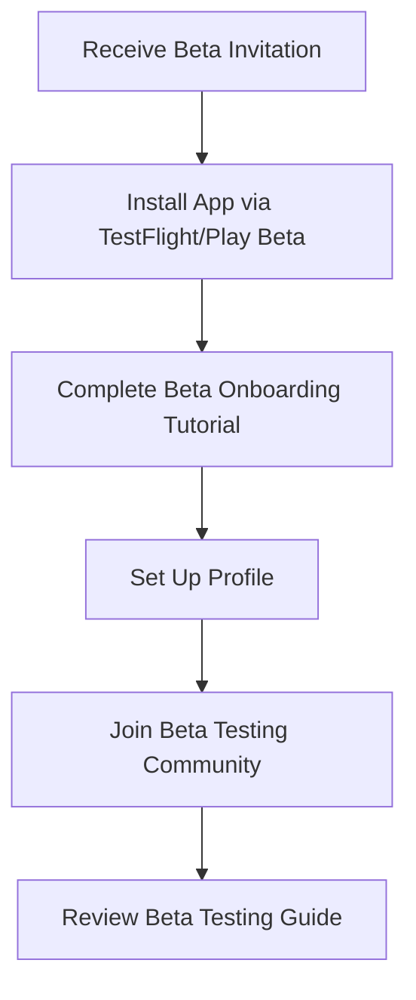
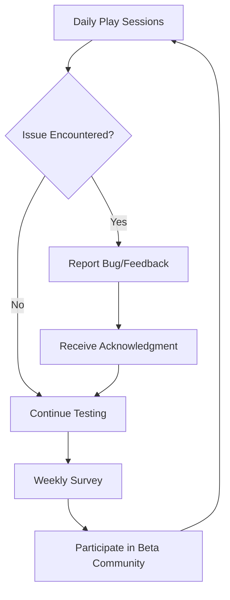

# Mind Wars - Beta Testing User Stories 🧪

## Document Purpose

This document defines the beta testing program for Mind Wars, including user stories, epics, features, and tasks to support controlled environment beta testing. Beta testing focuses on real-world usage validation before production launch, with hosted servers and structured feedback collection.

**Last Updated**: November 12, 2025  
**Version**: 1.0  
**Status**: Planning

---

## Table of Contents

1. [Beta Testing Overview](#beta-testing-overview)
2. [Beta vs Alpha Testing](#beta-vs-alpha-testing)
3. [Beta Tester User Journey](#beta-tester-user-journey)
4. [Beta Testing Epics](#beta-testing-epics)
   - [Epic 1: Beta Infrastructure Setup](#epic-1-beta-infrastructure-setup)
   - [Epic 2: Beta Tester Experience](#epic-2-beta-tester-experience)
   - [Epic 3: Feedback Collection & Analysis](#epic-3-feedback-collection--analysis)
   - [Epic 4: Monitoring & Observability](#epic-4-monitoring--observability)
5. [User Personas for Beta Testing](#user-personas-for-beta-testing)
6. [Success Metrics](#success-metrics)

---

## Beta Testing Overview

### What is Beta Testing?

Beta testing is the final pre-production validation phase where:
- **Real users** test the app in **real-world conditions**
- Testing occurs on **hosted production-like servers** in a controlled environment
- Comprehensive **monitoring and analytics** track usage and issues
- Structured **feedback loops** capture user experience insights
- Testing validates **readiness for public release**

### Beta Testing Goals

1. **Validate Production Readiness**: Ensure all features work in production-like conditions
2. **Identify Edge Cases**: Discover issues not found in alpha testing
3. **Measure Performance**: Validate server capacity, response times, and reliability
4. **Gather User Feedback**: Understand user experience from diverse perspectives
5. **Test Scalability**: Validate system behavior with concurrent users
6. **Build Launch Confidence**: Ensure team confidence for public launch

### Controlled Environment

Beta testing uses:
- **Staging servers** that mirror production configuration
- **Dedicated beta environment** isolated from production
- **Real-time monitoring** and alerting
- **Database snapshots** for rollback capability
- **Rate limiting** to control load
- **Feature flags** for gradual rollout

---

## Beta vs Alpha Testing

| Aspect | Alpha Testing | Beta Testing |
|--------|---------------|--------------|
| **Environment** | Local builds, dev servers | Hosted production-like servers |
| **Distribution** | Manual APK sharing, TestFlight | TestFlight, Google Play Beta Track |
| **User Base** | Internal team, close contacts | Invited external users (50-100+) |
| **Duration** | 1-2 weeks | 4-6 weeks |
| **Focus** | Core functionality, critical bugs | Real-world usage, edge cases, UX |
| **Monitoring** | Basic logging | Full analytics, crash reporting, APM |
| **Feedback** | Ad-hoc (GitHub issues, chat) | Structured (surveys, in-app feedback) |
| **Server Setup** | Development/staging | Production-like with monitoring |
| **Data** | Test data, can be wiped | Persistent, backed up |
| **Support** | Developer support | Dedicated beta support channel |

---

## Beta Tester User Journey

### Phase 1: Invitation & Onboarding (Day 1)

**User Story**: *As a beta tester, I want clear instructions on how to get started so that I can begin testing quickly and confidently.*

**Experience Steps**:
1. **Invitation Email** - Receive welcome email with:
   - Beta program overview and expectations
   - Installation instructions (platform-specific)
   - Link to beta testing guide
   - Community/support channel access
   - Beta testing code of conduct

2. **App Installation** - Easy installation via:
   - **iOS**: TestFlight invitation link → Install → Launch
   - **Android**: Google Play Beta Track enrollment → Install → Launch

3. **Beta Welcome Screen** - In-app onboarding showing:
   - Beta program purpose and goals
   - How to provide feedback
   - Link to known issues
   - Beta testing rewards (badges, early access)

4. **Profile Setup** - Standard registration plus:
   - Beta tester consent
   - Testing preference selection (casual vs intensive)
   - Demographics for diverse testing coverage

### Phase 2: Active Testing (Weeks 1-4)

**User Story**: *As a beta tester, I want a seamless testing experience with easy ways to report issues so that I can help improve the app.*

**Experience Steps**:
1. **Regular Gameplay** - Test all features:
   - Create and join lobbies with other beta testers
   - Play all game types across categories
   - Test chat, emoji reactions, voting
   - Explore progression and leaderboards
   - Test offline mode scenarios
   - Try edge cases (poor connectivity, app backgrounding)

2. **In-App Feedback** - Quick feedback options:
   - Shake device → Bug report screen
   - Long-press "Help" → Feedback form
   - In-game "Report Issue" button
   - Automatic screenshot capture
   - Device info auto-populated

3. **Structured Feedback** - Weekly engagement:
   - **Weekly Survey** - 5-10 questions about experience
   - **Feature Rating** - Rate new features tested
   - **Bug Reports** - Submit via in-app form or community
   - **Suggestion Box** - Share improvement ideas

4. **Community Participation** - Engage with other testers:
   - Beta Discord/Slack channel
   - Weekly Q&A sessions with developers
   - Beta tester leaderboard
   - Exclusive beta tester badge in-app

### Phase 3: Focused Testing (Weeks 2-4)

**User Story**: *As a beta tester, I want to participate in targeted testing campaigns so that I can help validate specific features.*

**Experience Steps**:
1. **Testing Campaigns** - Receive focused testing requests:
   - **Week 2**: Multiplayer stability - play 10+ matches
   - **Week 3**: Offline mode - test disconnection scenarios
   - **Week 4**: Performance - test on older devices
   - **Week 4**: Social features - invite friends, test chat

2. **Guided Test Scenarios** - Follow test scripts:
   - Specific user flows to validate
   - Expected vs actual behavior checklists
   - Edge case scenarios to reproduce
   - Performance benchmarks to verify

3. **Reward Recognition** - Acknowledge contributions:
   - Beta tester leaderboard (by feedback quality)
   - Exclusive badges (Bug Hunter, Feature Champion)
   - Early access to new features
   - Credits/perks in production app

### Phase 4: Wrap-Up & Launch (Week 5-6)

**User Story**: *As a beta tester, I want to see how my feedback influenced the product so that I feel valued and engaged.*

**Experience Steps**:
1. **Impact Report** - Receive summary showing:
   - Total bugs reported and fixed
   - Features improved based on feedback
   - Beta program statistics
   - Personal contribution summary

2. **Launch Preparation** - Prepare for transition:
   - Account migration plan to production
   - Launch date announcement
   - Continued perks for beta testers
   - Invitation to post-launch community

3. **Launch Celebration** - Celebrate with testers:
   - Special "Founding Beta Tester" badge
   - Launch day event/game tournament
   - Thank you message from team
   - Recognition in app credits

---

## Beta Testing Epics

## Epic 1: Beta Infrastructure Setup

**Epic Goal**: Establish production-like infrastructure to support beta testing with monitoring, stability, and data integrity

**Business Value**: Ensures reliable testing environment that accurately represents production conditions

**Target Personas**: DevOps, Backend Engineers, Product Team

**Story Points**: 55 points

---

### Feature 1.1: Beta Environment Configuration

**As a DevOps engineer**, I want to set up a dedicated beta environment so that testers can use a stable, production-like system

**Acceptance Criteria**:
- Beta environment mirrors production architecture
- Separate database and API servers from development
- Environment uses production-grade configurations
- SSL certificates configured for beta domains
- Environment variables documented and version-controlled
- Rollback procedures documented

#### Tasks:

**Task 1.1.1**: Provision Beta Server Infrastructure (8 points)
- Set up cloud infrastructure (AWS/GCP/Azure)
- Configure load balancers and auto-scaling
- Set up database instances (primary + replica)
- Configure Redis cache for session management
- Set up CDN for static assets
- Document infrastructure architecture
- **Estimated Time**: 1 week
- **Dependencies**: Cloud provider account with budget approval

**Task 1.1.2**: Configure Beta Domain and SSL (2 points)
- Register beta subdomain (e.g., beta.mindwars.app)
- Configure DNS records
- Provision SSL certificates (Let's Encrypt/AWS Certificate Manager)
- Set up HTTPS redirects
- Verify SSL grade (A+ rating)
- **Estimated Time**: 4 hours
- **Dependencies**: Domain registrar access

**Task 1.1.3**: Deploy API Server to Beta Environment (5 points)
- Set up CI/CD pipeline for beta deployments
- Configure environment variables for beta
- Deploy RESTful API endpoints
- Deploy Socket.io server
- Configure CORS for beta domains
- Set up health check endpoints
- **Estimated Time**: 3 days
- **Dependencies**: API codebase completed

**Task 1.1.4**: Configure Beta Database with Test Data (5 points)
- Provision PostgreSQL/MySQL database instance
- Run schema migrations
- Seed test data (users, games, lobbies)
- Set up automated backups (daily)
- Configure point-in-time recovery
- Document database connection strings
- **Estimated Time**: 3 days
- **Dependencies**: Database schema finalized

**Task 1.1.5**: Set Up API Rate Limiting (3 points)
- Implement rate limiting middleware
- Configure limits per endpoint (e.g., 100 req/min)
- Set up IP-based throttling
- Configure authenticated user limits
- Add rate limit headers to responses
- Test rate limiting behavior
- **Estimated Time**: 1 day
- **Dependencies**: API server deployed

---

### Feature 1.2: Monitoring & Observability

**As a DevOps engineer**, I want comprehensive monitoring so that I can identify and resolve issues quickly during beta testing

**Acceptance Criteria**:
- Real-time monitoring dashboards accessible
- Alerts configured for critical issues
- Error tracking captures all exceptions
- Performance metrics tracked (latency, throughput)
- Logs centralized and searchable
- On-call procedures documented

#### Tasks:

**Task 1.2.1**: Set Up Application Performance Monitoring (5 points)
- Integrate APM tool (New Relic/Datadog/AppDynamics)
- Configure transaction tracing
- Set up custom metrics (game completions, lobby joins)
- Create performance dashboards
- Configure performance alerts (p95 > 500ms)
- **Estimated Time**: 3 days
- **Dependencies**: API server deployed

**Task 1.2.2**: Configure Error Tracking (3 points)
- Integrate error tracking (Sentry/Rollbar)
- Configure source maps for stack traces
- Set up error grouping and deduplication
- Configure Slack/email notifications for new errors
- Set up error rate alerts (>10 errors/min)
- **Estimated Time**: 1 day
- **Dependencies**: API and client apps deployed

**Task 1.2.3**: Set Up Log Aggregation (5 points)
- Deploy log aggregation (ELK stack/CloudWatch/Datadog Logs)
- Configure structured logging (JSON format)
- Set up log retention policies (30 days)
- Create log search indexes
- Configure log-based alerts
- Document common log queries
- **Estimated Time**: 3 days
- **Dependencies**: Server infrastructure provisioned

**Task 1.2.4**: Create Monitoring Dashboards (5 points)
- Create system health dashboard (CPU, memory, disk)
- Create application dashboard (requests, errors, latency)
- Create business metrics dashboard (DAU, game plays, lobby creates)
- Create real-time user activity dashboard
- Configure dashboard sharing and access control
- **Estimated Time**: 3 days
- **Dependencies**: Monitoring tools configured

**Task 1.2.5**: Configure Uptime Monitoring (2 points)
- Set up external uptime monitoring (Pingdom/UptimeRobot)
- Configure health check endpoints
- Set up multi-region monitoring
- Configure downtime alerts (SMS, email, Slack)
- Create status page (status.mindwars.app)
- **Estimated Time**: 4 hours
- **Dependencies**: Beta environment deployed

---

### Feature 1.3: Beta Deployment Pipeline

**As a developer**, I want automated beta deployments so that I can ship fixes and updates quickly during beta testing

**Acceptance Criteria**:
- CI/CD pipeline deploys to beta automatically
- Blue-green deployments minimize downtime
- Automated tests run before deployment
- Rollback can be triggered in < 5 minutes
- Deployment notifications sent to team
- Deployment history tracked

#### Tasks:

**Task 1.3.1**: Configure CI/CD for Beta Deployments (5 points)
- Set up GitHub Actions/GitLab CI/Jenkins
- Configure deployment pipeline (test → build → deploy)
- Set up deployment triggers (push to beta branch)
- Configure environment-specific builds
- Add deployment approval gates
- Document deployment process
- **Estimated Time**: 3 days
- **Dependencies**: Beta infrastructure ready

**Task 1.3.2**: Implement Blue-Green Deployment (5 points)
- Configure load balancer for blue-green deployments
- Set up deployment scripts
- Implement health checks before traffic switch
- Configure automatic rollback on health check failure
- Test deployment and rollback procedures
- **Estimated Time**: 3 days
- **Dependencies**: Load balancer configured

**Task 1.3.3**: Set Up Deployment Notifications (2 points)
- Configure Slack webhook for deployment notifications
- Add deployment start/success/failure messages
- Include deployment metadata (version, commit, deployer)
- Add links to monitoring dashboards
- **Estimated Time**: 4 hours
- **Dependencies**: CI/CD pipeline configured

---

## Epic 2: Beta Tester Experience

**Epic Goal**: Provide beta testers with an excellent testing experience that makes it easy to participate, provide feedback, and feel valued

**Business Value**: High-quality beta testing feedback leads to better product and engaged early adopters

**Target Personas**: Beta Testers (all user personas)

**Story Points**: 46 points

---

### Feature 2.1: Beta Tester Onboarding

**As a beta tester**, I want clear onboarding so that I understand how to participate effectively in beta testing

**Acceptance Criteria**:
- Onboarding flow introduces beta program
- Installation instructions are platform-specific and clear
- Beta welcome screen appears on first launch
- Tester can access beta guide anytime
- Tester receives confirmation of successful enrollment

#### Tasks:

**Task 2.1.1**: Create Beta Invitation Email Template (2 points)
- Design email template with branding
- Include welcome message and program overview
- Add platform-specific installation instructions
- Include links to beta guide and support
- Add beta tester code of conduct
- Set up email automation
- **Estimated Time**: 4 hours
- **Dependencies**: Email service configured

**Task 2.1.2**: Implement Beta Welcome Screen (3 points)
- Design welcome screen UI (native iOS/Android)
- Show beta program overview
- Add "How to Provide Feedback" section
- Include link to known issues and roadmap
- Add "Get Started" button to dismiss
- Store flag to show only once
- **Estimated Time**: 1 day
- **Dependencies**: Mobile app framework ready

**Task 2.1.3**: Create Beta Testing Guide Document (3 points)
- Write comprehensive beta testing guide
- Include testing objectives and focus areas
- Document feedback submission process
- Add FAQs for common questions
- Include contact information for support
- Publish guide on website or wiki
- **Estimated Time**: 1 day
- **Dependencies**: Beta program details finalized

**Task 2.1.4**: Set Up Beta TestFlight/Play Beta Track (5 points)
- Configure TestFlight for iOS beta distribution
- Set up Google Play Beta Track for Android
- Configure app metadata and screenshots
- Set up tester groups and limits
- Test invitation and installation flow
- Document tester addition process
- **Estimated Time**: 3 days
- **Dependencies**: App builds ready for beta

---

### Feature 2.2: Beta Distribution & Installation

**As a beta tester**, I want easy installation so that I can start testing without technical difficulties

**Acceptance Criteria**:
- iOS testers can install via TestFlight with one click
- Android testers can install via Play Beta Track
- Installation process takes < 5 minutes
- Testers receive confirmation after installation
- Support documentation covers troubleshooting

#### Tasks:

**Task 2.2.1**: Configure TestFlight Beta Distribution (iOS) (5 points)
- Create App Store Connect beta testing group
- Upload beta build to TestFlight
- Configure build metadata and release notes
- Set up external tester groups (up to 10,000)
- Test invitation and feedback collection
- Document TestFlight admin process
- **Estimated Time**: 3 days
- **Dependencies**: iOS app build ready

**Task 2.2.2**: Configure Google Play Beta Track (Android) (5 points)
- Create closed beta track in Google Play Console
- Upload beta APK/AAB
- Configure beta listing and screenshots
- Set up tester list via email or Google Group
- Enable beta feedback collection
- Document Play Console admin process
- **Estimated Time**: 3 days
- **Dependencies**: Android app build ready

**Task 2.2.3**: Create Installation Documentation (2 points)
- Write iOS installation guide with screenshots
- Write Android installation guide with screenshots
- Document common installation issues and solutions
- Add troubleshooting section
- Create video tutorial for each platform
- **Estimated Time**: 4 hours
- **Dependencies**: Beta distribution configured

---

### Feature 2.3: Beta Tester Community

**As a beta tester**, I want to connect with other testers so that I can share experiences and collaborate

**Acceptance Criteria**:
- Beta testers have access to dedicated community channel
- Community is moderated and supportive
- Developers participate in community regularly
- Weekly Q&A sessions scheduled
- Community guidelines posted and enforced

#### Tasks:

**Task 2.3.1**: Set Up Beta Community Channel (3 points)
- Create Discord server or Slack workspace for beta testers
- Configure channels (general, bug-reports, suggestions, q-and-a)
- Set up moderator roles and permissions
- Add welcome bot with auto-response
- Post community guidelines
- **Estimated Time**: 1 day
- **Dependencies**: Community platform selected

**Task 2.3.2**: Schedule Weekly Q&A Sessions (2 points)
- Schedule recurring Q&A sessions (e.g., every Friday)
- Create event calendar and reminders
- Prepare Q&A format and moderation guidelines
- Assign team members to participate
- Record sessions for those who can't attend
- **Estimated Time**: 4 hours
- **Dependencies**: Beta community channel set up

**Task 2.3.3**: Create Beta Tester Recognition Program (3 points)
- Design beta tester badges (Bug Hunter, Feature Champion, etc.)
- Create in-app leaderboard for beta testers
- Implement point system for contributions
- Configure rewards (early access, credits)
- Announce recognition program to testers
- **Estimated Time**: 1 day
- **Dependencies**: Badge system in app

---

### Feature 2.4: Guided Testing Campaigns

**As a product manager**, I want to run targeted testing campaigns so that I can validate specific features systematically

**Acceptance Criteria**:
- Testing campaigns can be created and assigned
- Testers receive campaign notifications
- Campaign progress is tracked
- Testers can mark campaigns complete
- Campaign results are summarized

#### Tasks:

**Task 2.4.1**: Design Testing Campaign Framework (5 points)
- Define campaign structure (objectives, test cases, expected outcomes)
- Create campaign templates for common scenarios
- Design notification system for campaign assignments
- Implement campaign tracking dashboard
- Design campaign completion rewards
- **Estimated Time**: 3 days
- **Dependencies**: Product requirements defined

**Task 2.4.2**: Implement In-App Campaign Notifications (5 points)
- Design campaign notification UI
- Implement push notifications for campaign launches
- Add in-app inbox for campaign details
- Create campaign detail screen with test steps
- Implement campaign completion tracking
- **Estimated Time**: 3 days
- **Dependencies**: Mobile app notification system

**Task 2.4.3**: Create Initial Testing Campaigns (3 points)
- Create Week 1 campaign (core gameplay flows)
- Create Week 2 campaign (multiplayer stability)
- Create Week 3 campaign (offline mode testing)
- Create Week 4 campaign (social features)
- Write test scripts with expected vs actual sections
- **Estimated Time**: 1 day
- **Dependencies**: Features to test completed

---

## Epic 3: Feedback Collection & Analysis

**Epic Goal**: Capture comprehensive feedback from beta testers and analyze it to drive product improvements

**Business Value**: High-quality feedback insights lead to better product decisions and higher launch quality

**Target Personas**: Product Managers, UX Designers, Developers

**Story Points**: 42 points

---

### Feature 3.1: In-App Feedback System

**As a beta tester**, I want to easily report bugs and provide feedback so that I can help improve the app

**Acceptance Criteria**:
- Bug report accessible via shake gesture or menu
- Feedback form is quick to fill out (< 2 minutes)
- Screenshots are automatically captured
- Device info is auto-populated
- Tester receives confirmation after submission
- Feedback is routed to appropriate team

#### Tasks:

**Task 3.1.1**: Implement Shake-to-Report Bug (5 points)
- Add shake gesture detection (iOS/Android)
- Trigger bug report screen on shake
- Automatically capture screenshot
- Pre-populate device info and app version
- Add haptic feedback for gesture confirmation
- **Estimated Time**: 3 days
- **Dependencies**: Mobile app framework

**Task 3.1.2**: Create Feedback Form UI (5 points)
- Design feedback form with fields (title, description, type)
- Add severity selector (low, medium, high, critical)
- Add category dropdown (bug, feature request, UX feedback)
- Add screenshot annotation tool
- Implement form validation
- Add "Submit" and "Cancel" buttons
- **Estimated Time**: 3 days
- **Dependencies**: UI design approved

**Task 3.1.3**: Implement Feedback Submission API (5 points)
- Create feedback API endpoint (`POST /feedback`)
- Validate feedback data
- Store feedback in database
- Upload screenshots to S3/Cloud Storage
- Send notifications to team (Slack/email)
- Return confirmation to user
- **Estimated Time**: 3 days
- **Dependencies**: Backend API ready

**Task 3.1.4**: Set Up Feedback Dashboard (5 points)
- Create admin dashboard for feedback review
- Implement filtering (type, severity, status)
- Add feedback detail view with screenshots
- Implement status tracking (new, in-review, resolved)
- Add assignment and commenting features
- **Estimated Time**: 3 days
- **Dependencies**: Feedback API completed

---

### Feature 3.2: Automated Surveys

**As a product manager**, I want to send automated surveys so that I can gather structured feedback at scale

**Acceptance Criteria**:
- Surveys can be created and scheduled
- In-app surveys appear at appropriate times
- Survey responses are collected and analyzed
- Survey participation rate > 40%
- Results are visualized in dashboard

#### Tasks:

**Task 3.2.1**: Integrate Survey Tool (5 points)
- Select and integrate survey platform (Typeform/SurveyMonkey/custom)
- Configure API integration
- Set up survey templates
- Configure survey triggering rules
- Test survey delivery and response collection
- **Estimated Time**: 3 days
- **Dependencies**: Survey platform account

**Task 3.2.2**: Create Weekly Survey Templates (3 points)
- Design Week 1 survey (onboarding experience)
- Design Week 2 survey (gameplay satisfaction)
- Design Week 3 survey (feature usage)
- Design Week 4 survey (overall experience)
- Keep surveys short (5-10 questions)
- **Estimated Time**: 1 day
- **Dependencies**: Survey goals defined

**Task 3.2.3**: Implement In-App Survey Prompts (5 points)
- Design non-intrusive survey prompt UI
- Implement survey scheduling logic
- Add "Take Survey" and "Maybe Later" options
- Track survey completion status
- Prevent duplicate survey prompts
- **Estimated Time**: 3 days
- **Dependencies**: Survey API integrated

**Task 3.2.4**: Create Survey Analytics Dashboard (5 points)
- Aggregate survey responses by week
- Create visualizations (charts, graphs)
- Implement sentiment analysis for text responses
- Generate weekly summary reports
- Export results to CSV/PDF
- **Estimated Time**: 3 days
- **Dependencies**: Survey responses collected

---

### Feature 3.3: Feedback Triage & Prioritization

**As a product manager**, I want to triage feedback efficiently so that I can prioritize improvements effectively

**Acceptance Criteria**:
- All feedback is reviewed within 24 hours
- Feedback is categorized and prioritized
- Critical bugs are escalated immediately
- Feature requests are grouped by theme
- Triage decisions are documented

#### Tasks:

**Task 3.3.1**: Implement Feedback Triage Workflow (5 points)
- Define triage process and criteria
- Create triage checklist template
- Set up triage meeting schedule (daily during beta)
- Assign triage responsibilities
- Document triage decisions in feedback tool
- **Estimated Time**: 3 days
- **Dependencies**: Feedback dashboard ready

**Task 3.3.2**: Configure Feedback Routing Rules (3 points)
- Set up automatic routing by category
- Configure severity-based escalation (critical → Slack alert)
- Assign feedback to team members
- Set up SLA alerts (24-hour review SLA)
- Implement duplicate detection
- **Estimated Time**: 1 day
- **Dependencies**: Feedback system live

**Task 3.3.3**: Create Feedback Analysis Reports (3 points)
- Generate daily feedback summary report
- Create weekly feedback trends analysis
- Identify top issues and feature requests
- Track feedback resolution rate
- Share reports with stakeholders
- **Estimated Time**: 1 day
- **Dependencies**: Sufficient feedback data collected

---

## Epic 4: Monitoring & Observability

**Epic Goal**: Gain deep visibility into beta testing activities, system performance, and user behavior

**Business Value**: Data-driven insights enable proactive issue resolution and better product decisions

**Target Personas**: Engineers, Product Managers, Data Analysts

**Story Points**: 58 points

---

### Feature 4.1: User Analytics

**As a product manager**, I want detailed analytics on user behavior so that I can understand how testers use the app

**Acceptance Criteria**:
- All key user actions are tracked
- Analytics dashboard shows real-time data
- User funnels identify drop-off points
- Retention metrics tracked daily
- Data is exportable for deeper analysis

#### Tasks:

**Task 4.1.1**: Integrate Analytics SDK (5 points)
- Select analytics platform (Mixpanel/Amplitude/Firebase Analytics)
- Integrate SDK into iOS app
- Integrate SDK into Android app
- Configure user properties (tester ID, device, OS)
- Test analytics data collection
- **Estimated Time**: 3 days
- **Dependencies**: Analytics platform account

**Task 4.1.2**: Define and Implement Event Tracking (8 points)
- Define key events to track (50+ events):
  - User registration/login
  - Lobby creation/joining
  - Game selection/voting
  - Game completion
  - Chat messages sent
  - Feedback submitted
  - App launch/background/crash
- Implement event tracking throughout app
- Add event properties for context
- Test event tracking
- **Estimated Time**: 1 week
- **Dependencies**: Analytics SDK integrated

**Task 4.1.3**: Create User Behavior Dashboards (5 points)
- Create DAU/WAU/MAU dashboard
- Create user funnel analysis (registration → first game)
- Create feature usage dashboard
- Create retention cohort analysis
- Create engagement metrics dashboard
- **Estimated Time**: 3 days
- **Dependencies**: Analytics events tracking

**Task 4.1.4**: Set Up Anomaly Detection Alerts (3 points)
- Configure alerts for unusual activity patterns
- Set up crash rate alerts (>1% crash rate)
- Configure DAU drop alerts (>20% day-over-day drop)
- Set up conversion funnel drop-off alerts
- Test alert delivery
- **Estimated Time**: 1 day
- **Dependencies**: Analytics dashboards created

---

### Feature 4.2: Performance Monitoring

**As a developer**, I want performance monitoring so that I can identify and fix performance issues

**Acceptance Criteria**:
- API response times tracked per endpoint
- App performance metrics collected (startup time, frame rate)
- Slow transactions automatically flagged
- Performance regressions detected
- Performance data correlated with releases

#### Tasks:

**Task 4.2.1**: Implement Client-Side Performance Monitoring (5 points)
- Integrate performance monitoring SDK (Firebase Performance/New Relic)
- Track app startup time
- Track screen render times
- Track network request durations
- Track frame rate and UI responsiveness
- **Estimated Time**: 3 days
- **Dependencies**: Performance monitoring SDK selected

**Task 4.2.2**: Implement Server-Side Performance Monitoring (5 points)
- Track API endpoint response times
- Track database query performance
- Track external API call latencies
- Measure throughput (requests per second)
- Identify slow transactions (p95, p99)
- **Estimated Time**: 3 days
- **Dependencies**: APM tool configured

**Task 4.2.3**: Create Performance Dashboards (3 points)
- Create API performance dashboard (latency, throughput, errors)
- Create mobile performance dashboard (startup, rendering, crashes)
- Create infrastructure dashboard (CPU, memory, network)
- Set performance budgets and visualize
- **Estimated Time**: 1 day
- **Dependencies**: Performance metrics collected

**Task 4.2.4**: Configure Performance Alerts (3 points)
- Alert on API p95 latency > 500ms
- Alert on app crash rate > 1%
- Alert on database connection pool exhaustion
- Alert on high CPU/memory usage (>80%)
- Test alert delivery and escalation
- **Estimated Time**: 1 day
- **Dependencies**: Performance monitoring configured

---

### Feature 4.3: Error & Crash Reporting

**As a developer**, I want comprehensive error reporting so that I can quickly identify and fix crashes

**Acceptance Criteria**:
- All crashes automatically reported with stack traces
- Errors grouped and deduplicated
- Crash-free user rate > 99.5%
- Critical crashes escalated immediately
- Crash trends tracked over time

#### Tasks:

**Task 4.3.1**: Integrate Crash Reporting SDK (5 points)
- Integrate crash reporting (Crashlytics/Sentry/Bugsnag)
- Configure for iOS and Android
- Set up source map upload for symbolication
- Configure user context (tester ID, device)
- Test crash reporting
- **Estimated Time**: 3 days
- **Dependencies**: Crash reporting tool selected

**Task 4.3.2**: Configure Error Alerts and Escalation (3 points)
- Set up Slack alerts for new crash types
- Configure PagerDuty for critical crashes
- Set up email digests for non-critical errors
- Define crash severity criteria
- Test alert delivery
- **Estimated Time**: 1 day
- **Dependencies**: Crash reporting integrated

**Task 4.3.3**: Create Crash Analysis Dashboard (3 points)
- Create crash-free user rate dashboard
- Create top crashes by occurrence
- Create crash trends over time
- Create device/OS breakdown for crashes
- Add affected user count per crash
- **Estimated Time**: 1 day
- **Dependencies**: Crash data collected

---

### Feature 4.4: Server & Infrastructure Monitoring

**As a DevOps engineer**, I want infrastructure monitoring so that I can ensure system reliability

**Acceptance Criteria**:
- System metrics monitored in real-time
- Alerts configured for resource exhaustion
- Infrastructure health visible on dashboard
- Historical metrics stored for trend analysis
- Capacity planning data available

#### Tasks:

**Task 4.4.1**: Configure Infrastructure Monitoring (5 points)
- Set up server monitoring (CPU, memory, disk, network)
- Configure database monitoring (connections, queries, replication lag)
- Set up load balancer monitoring
- Monitor cache hit rates (Redis)
- Configure log disk space monitoring
- **Estimated Time**: 3 days
- **Dependencies**: Infrastructure deployed

**Task 4.4.2**: Create Infrastructure Dashboards (3 points)
- Create system health dashboard
- Create database performance dashboard
- Create network traffic dashboard
- Create capacity planning dashboard
- **Estimated Time**: 1 day
- **Dependencies**: Infrastructure metrics collected

**Task 4.4.3**: Configure Infrastructure Alerts (2 points)
- Alert on CPU usage > 80%
- Alert on memory usage > 85%
- Alert on disk usage > 80%
- Alert on database connection pool > 80%
- Alert on replication lag > 60 seconds
- **Estimated Time**: 4 hours
- **Dependencies**: Monitoring configured

---

## User Personas for Beta Testing

### Beta Tester Persona 1: The Enthusiast

**Name**: Alex Chen  
**Age**: 28  
**Occupation**: Software Developer  
**Tech Savvy**: Very High

**Background**:
- Early adopter of new apps and tech
- Active in online communities (Reddit, Discord)
- Contributes to open source projects
- Enjoys providing detailed feedback

**Beta Testing Behavior**:
- Tests app daily, explores all features
- Reports bugs with detailed reproduction steps
- Suggests feature improvements proactively
- Participates actively in beta community
- Tests edge cases and tries to "break" the app

**Needs from Beta Program**:
- Direct line to developers
- Recognition for contributions
- Influence on product direction
- Early access to new features

**User Story**: *As an enthusiast beta tester, I want to provide detailed feedback and see it implemented so that I can feel like I'm contributing to the product's success.*

---

### Beta Tester Persona 2: The Casual User

**Name**: Maria Santos  
**Age**: 34  
**Occupation**: Marketing Manager  
**Tech Savvy**: Medium

**Background**:
- Uses mobile apps daily but not a "techie"
- Interested in brain training and casual gaming
- Busy schedule, testing when convenient
- Provides feedback when prompted

**Beta Testing Behavior**:
- Tests app 2-3 times per week
- Reports obvious bugs via in-app feedback
- Responds to surveys when prompted
- Focuses on user experience and ease of use
- Represents mainstream user perspective

**Needs from Beta Program**:
- Easy feedback submission
- Clear instructions and guidance
- Appreciation for participation
- Simple, intuitive testing process

**User Story**: *As a casual beta tester, I want to provide feedback easily during normal usage so that I don't need to invest extra time beyond playing.*

---

### Beta Tester Persona 3: The Family Tester

**Name**: Robert Johnson  
**Age**: 45  
**Occupation**: High School Teacher  
**Tech Savvy**: Medium

**Background**:
- Plans to play with family members
- Interested in intergenerational gaming
- Concerned about age-appropriate content
- Values educational aspects

**Beta Testing Behavior**:
- Tests with spouse and teenage children
- Focuses on multiplayer and social features
- Reports issues related to family dynamics
- Provides feedback on game difficulty and variety
- Tests across multiple devices

**Needs from Beta Program**:
- Family-friendly testing environment
- Multi-device testing support
- Feedback on family gaming experience
- Confidence in content safety

**User Story**: *As a family beta tester, I want to test the app with my family members so that I can ensure it provides a positive experience for all ages.*

---

## Success Metrics

### Beta Testing Program Metrics

| Metric | Target | Measurement |
|--------|--------|-------------|
| **Tester Enrollment** | 100+ beta testers | Total registered beta testers |
| **Active Testers** | 70% weekly active | Weekly active testers / total testers |
| **Feedback Volume** | 200+ feedback items | Total bugs + feature requests + surveys |
| **Survey Response Rate** | 50%+ | Survey completions / surveys sent |
| **Crash-Free Rate** | 99.5%+ | Sessions without crashes / total sessions |
| **App Store Rating** | 4.5+ stars | Average rating from beta testers |
| **Bug Fix Rate** | 80%+ within beta | Bugs fixed / total bugs reported |
| **Feature Adoption** | 80%+ try all features | % of testers who try each feature |

### Technical Performance Metrics

| Metric | Target | Measurement |
|--------|--------|-------------|
| **API Uptime** | 99.9%+ | Uptime monitoring |
| **API P95 Latency** | < 500ms | APM tracking |
| **App Startup Time** | < 2 seconds | Performance monitoring |
| **Daily Active Users** | 50+ daily | Analytics tracking |
| **Average Session Length** | 15+ minutes | Analytics tracking |
| **Lobby Creation Success** | 98%+ | Success rate tracking |
| **Game Completion Rate** | 85%+ | Games completed / games started |

### Quality Metrics

| Metric | Target | Measurement |
|--------|--------|-------------|
| **Critical Bugs** | 0 at launch | Bug tracking system |
| **High Priority Bugs** | < 5 at launch | Bug tracking system |
| **Test Coverage** | 80%+ | Code coverage reports |
| **Performance Regressions** | 0 | Performance monitoring |
| **Security Vulnerabilities** | 0 critical/high | Security scanning |

---

## Beta Testing Timeline

### Week 1-2: Beta Preparation
- [ ] Complete beta infrastructure setup
- [ ] Configure monitoring and alerting
- [ ] Prepare beta builds (iOS TestFlight + Android Play Beta)
- [ ] Create beta testing guide and documentation
- [ ] Set up beta tester community channel
- [ ] Recruit initial 50 beta testers

### Week 3: Beta Launch
- [ ] Send beta invitations to first cohort (50 testers)
- [ ] Monitor onboarding completion rates
- [ ] Respond to initial feedback and questions
- [ ] Fix critical bugs discovered in first week
- [ ] Send Week 1 survey
- [ ] Host first Q&A session

### Week 4-5: Active Testing
- [ ] Launch testing campaigns (multiplayer, offline mode)
- [ ] Expand beta to second cohort (50 more testers)
- [ ] Analyze feedback and prioritize fixes
- [ ] Deploy bug fixes and improvements
- [ ] Send weekly surveys
- [ ] Host weekly Q&A sessions

### Week 6-7: Focused Testing
- [ ] Run focused testing campaigns (performance, edge cases)
- [ ] Address all critical and high-priority bugs
- [ ] Conduct final round of surveys
- [ ] Prepare beta wrap-up report

### Week 8: Beta Wrap-Up
- [ ] Close beta testing program
- [ ] Send thank you and impact report to testers
- [ ] Prepare for production launch
- [ ] Migrate beta tester accounts to production
- [ ] Plan launch celebration event

---

## Beta Testing Checklist

### Pre-Beta Launch
- [ ] Beta infrastructure provisioned and tested
- [ ] Monitoring and alerting configured
- [ ] Beta builds uploaded to TestFlight/Play Beta
- [ ] Beta testing guide published
- [ ] Community channel set up
- [ ] Feedback tools integrated
- [ ] Survey templates created
- [ ] Initial testers recruited
- [ ] Team on-call schedule established

### During Beta
- [ ] Daily monitoring of system health
- [ ] Daily feedback triage
- [ ] Weekly surveys sent
- [ ] Weekly Q&A sessions held
- [ ] Bug fixes deployed regularly
- [ ] Testing campaigns executed
- [ ] Beta tester recognition updated
- [ ] Analytics reviewed weekly

### Post-Beta
- [ ] All critical bugs resolved
- [ ] High-priority bugs resolved or documented
- [ ] Final surveys analyzed
- [ ] Beta wrap-up report created
- [ ] Tester accounts migrated to production
- [ ] Thank you messages sent
- [ ] Beta program retrospective held
- [ ] Lessons learned documented

---

## Appendix: Beta Testing Resources

### Documentation Links
- [ALPHA_TESTING.md](ALPHA_TESTING.md) - Alpha testing guide
- [USER_STORIES.md](docs/business/USER_STORIES.md) - General user stories
- [PRODUCT_BACKLOG.md](PRODUCT_BACKLOG.md) - Product backlog
- [ARCHITECTURE.md](ARCHITECTURE.md) - Technical architecture

### External Tools
- **TestFlight**: iOS beta distribution
- **Google Play Console**: Android beta distribution
- **Monitoring**: New Relic, Datadog, or similar APM
- **Error Tracking**: Sentry, Crashlytics, or Bugsnag
- **Analytics**: Mixpanel, Amplitude, or Firebase Analytics
- **Surveys**: Typeform, SurveyMonkey, or Google Forms
- **Community**: Discord or Slack for beta testers

### Contact Information
- **Beta Support Email**: beta-support@mindwars.app
- **Beta Community**: [Discord/Slack link]
- **Status Page**: status.mindwars.app
- **Bug Reporting**: Via in-app feedback or GitHub Issues

---

**Document Version**: 1.0  
**Last Updated**: November 12, 2025  
**Next Review**: After Beta Launch (Week 4)
